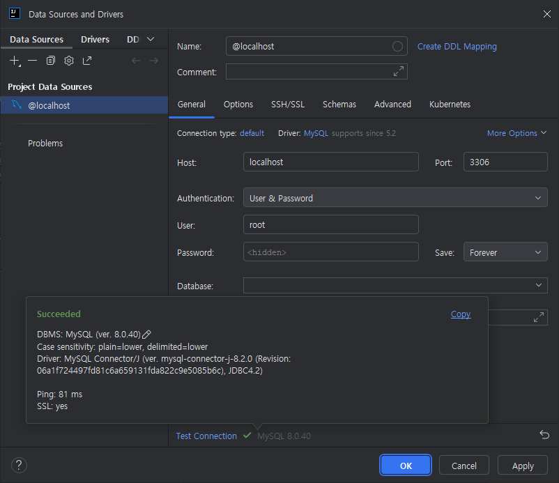
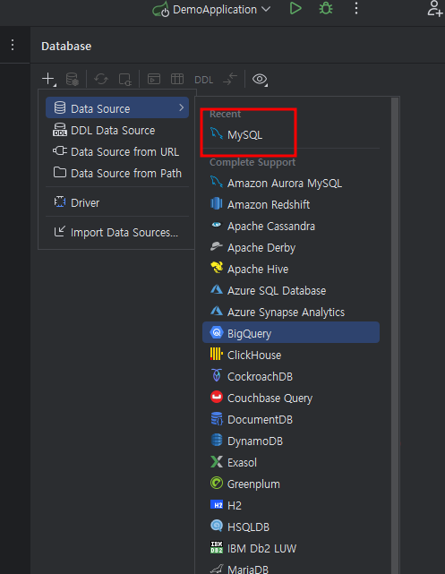
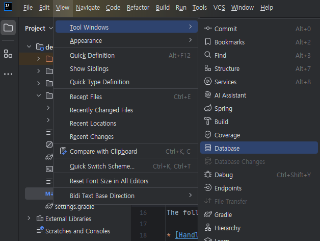
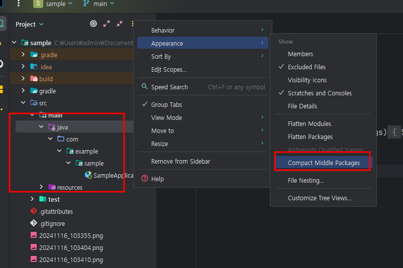

[Rest API란 무엇인가]
####Http 프로토콜 에서 Put, Delete를 추가하며
####JSON 형태로 데이터를 통신하는 것이다

[dependencies]
#### Lombok, DevTools, Spring Web, Thymeleaf, 

[@Controller + @RequestMapping = @RestContoller]
#### @RestController는 위 둘 합과 같다.

[Collection]
<ul>
    <li>Map</li>
    <li>Set</li>
    <li>List</li>
</ul>
